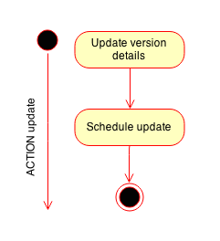

# OpsAgent Documentation

## Abstract

### Description

Official Repository: https://github.com/MadeiraCloud/opsagent

*OpsAgent* is part of the *VisualOps* project.

*OpsAgent* is bootstrapped on deployed instances at the creation of each app, in order to ensure the orchestration of instances' resources.

### Technology

*OpsAgent* is a **Python** software, using the following libraries:

- *[ws4py](https://github.com/Lawouach/WebSocket-for-Python)*: WebSocket library to ensure the connection to the Backend
- *[salt](https://github.com/saltstack/salt)*: Configuration Management software
- Additional dependencies to the previously listed libraries

### Authors

Thibault Bronchain - thibault [at] visualops [dot] io - (c) MadeiraCloud Ltd.

## Architecture

### Bootstrap

*OpsAgent* is bootstrapped by a set of bash scripts, defined at first in the [userdata](https://github.com/MadeiraCloud/opsagent/blob/master/scripts/userdata.sh) script.

The bootstrap process is robust, flexible and secured, using signed packages and dedicated scripts.

### OpsAgent execution

#### Main execution



*OpsAgent* is composed of two main parts, the *StatesWorker* (SW) and the *Manager* (MGR). 

The *StatesWorker* is where the *States* are executed. It is started in a standalone thread from the beginning, and should never be killed.

The *Manager* is responsible of the connection to the Backend. It is also started in a standalone thread, however, it is destroyed, then recreated, anytime a connection is established/lost.

#### Init



During the init phase, configuration data are gathered and required resources are created/verified.

### Network features

#### Opened connection



Anytime a connection is established, a HandShake (see [Protocol]()) message is sent.

#### Closed connection



Anytime a connection is closed (or lost), status flag are reset.

#### Stop



Process while stopping the agent.

#### Send message



All messages are Python dictionaries serialized into json objects.

In case of failure, connection to backend is shutdown to be re-negotiated.

#### Received message



All messages are json objects, converted back to python dictionaries. Objects contains an action code of the [action](#actions) to execute.

### Actions

#### Retry HandShake



If the HandShake failed, the Agent will try to re-negotiate the connection.

#### Update



*OpsAgent* is able to update itself if an order is gave by *OpsBackend*.

#### Wait



When a *wait* state is present, all succeed states will be recorded to a *done list*.

#### Recipe



When a new recipe is defined, *OpsAgent* will end the current states execution, then load the new recipe.

### StatesWorker

#### Global recipe execution



The *StatesWorker* is able to run loaded recipes indefinitely, until a new recipe is loaded or the Agent is stopped. SW gathers run results and reports to Backend.

#### State execution



Each *State* is run either directly by *OpsAgent* (built-ins), or the *Salt* library.

### Built-ins

#### Wait



Wait states are defined to pause the execution until an other instance's state is set as succeed.

#### Comment



Comment states are ignored.

### States

The states are defined in the official [VisualOps Documentation](http://docs.visualops.io/state/README.html).

## Protocol

See Protocol documentation.

## Tests

### OpsAgent tests

Tests can be found under `tests` directory. The `run.sh` script can be executed in order to run the tests.

It is recommended to run the tests under a instance configured to run *OpsAgent* (with it already installed).

The dependencies are listed at the beginning of the execution. You need to install them in order to run the tests.

### States tests

All states have independent and combined unit tests. You can use `states.sh` script under `tests` directory to run them.

Beware that you need to run the *OpsAgent* tests first.

Note: States tests must be executes as super-user.
